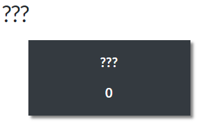

# Introduction

Aloha and Mahalo for participating in the Capture the Flag (CTF) event hosted by [ISC2 Hawaii](https://isc2hawaii.com/). 

## Important Information

To access the CTF platform please visit [here](https://ctf.isc2hawaii.com/).

## K-12 Participants Only
[K-12 Only Discord Server](https://discord.com/invite/EEUtj3d38z)

## Professional Participants Only
[Professionals Only Discord Server](https://discord.com/invite/7YmvJ9Sj6N)

## Rules

The following rules applies to both the CTF platform and Discord servers. You will be removed from participating in the CTF if you are caught.

* No inappropriate usernames and nicknames.
* No sexually usernames and explicit nicknames.
* No offensive usernames and nicknames.
* No inappropriate profile pictures.
* No sexually explicit profile pictures.
* No offensive profile pictures.
* No NSFW content.
* No illegal content.
* No harassment.
* No sexism.
* No racism.
* No hate speech.
* No offensive language/cursing.
* No collusion with other teams.
* Be professional and have fun!

## Registration

Begin by registering for a CTF account, on the top right of the CTF site. Click on "Register".
Be sure to fill out all the information such as the username, email address (must be able to verify account), a strong password, and your Affiliation (Name of the company or school that you're affiliated with e.g. Kaimuki High School, Hawaii Bank).

### Teams

Each team may have up to **5 (FIVE)** participants and multiple teams representing a school or company. However, please do not collude with others to gain an advantage. 

## Basic Information

### Challenges

There are various difficulty of challenges created in several Cybersecurity related categories to test your skills and knowledge. You will notice that there are some challenges that look like the picture below.

Please do not be alarmed as these challenges are not available until you have solved a pre-requisite challenge.

If you get stuck on a challenge, don't spend too much time on it and move onto another challenge to come back to it later.

### Live Challenges

In this CTF environment, there are ***live challenges*** that require you to open a ticket in the respective Discord server and post your responses from there.

***Note: The ticketing system isn't meant to be used to ask for help or hints. Please use the respective #help channel in the Discord server to ask for help. CTF Staff will not hold your hands in solving any challenges***

### Flags

All challenges have a standard flag format that is to be accepted as the answer to the challenge.

    Flag Example
    ISC2{This is a Flag}

In order to make this CTF easier, all flags are case insensitive and doesn't require you to have exactly the correct capital and lower case letters in the flag. However, there are submission limitations to prevent flooding random guesses. 

All multiple choice challenges will only allow **1 (ONE)** submission before the challenge is removed. All other challenges will only allow **3 (three)** submissions before the challenge is removed. 

***Note: Once the challenge is removed, you will not be given the chance to solve it again at a later time. So please put in some time and thought into it before submitting an answer.***

### Hints

We have provided hints onto all of our challenges. The first teaser hint cost **0** points, however each additional hint beyond the first one will cost you points.

### Points

All challenges have the assigned points:

| Difficulty | Points |
| ----------- | ----- |
| Easy        | 5     |
| Medium      | 10    |
| Hard        | 15    |